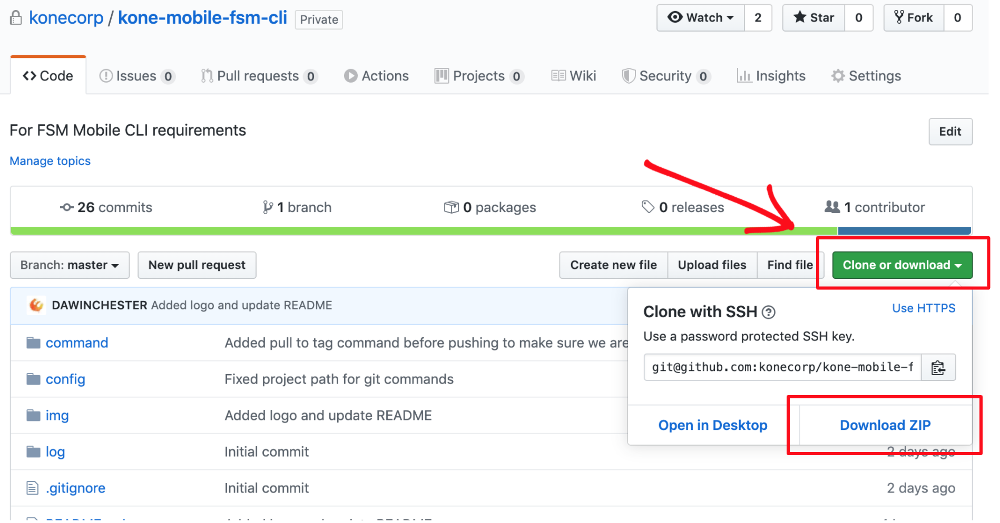

# KONE CLI


**A command line framework for managing the KONE FSM mobile applications**

The KONE command-line interface (CLI) is a cross-platform tool chain for 
building, running, and deploying the KONE FSM mobile applications. Rather than 
write the scripts in something like Go or Python, or merge them into a single 
bash script, I opted to build a framework which allows an executable to be presented 
as a sub-command.

## Example

```
kone help

kone app get-project --no-dependencies

kone app get-log --log-output /Users/yourusername/Desktop

kone app start-device

kone deploy create-release --version 1.2.3
```

## Customizing the CLI
The CLI is designed to make it as simple as possible for you to create **your** application.
To that end, everything that makes it the "KONE Mobile FSM CLI" can be changed by simply modifying
the files in the `command` directory.

## Adding Commands
The CLI commands are just a stock-standard script with a filename that matches the command name.
These scripts are contained within the `command` folder, or within nested folders there if you want
to create a tree-based command structure.

For example, the script `command/test/hello` would be available through `kone test hello`. Any arguments
passed after the command will be curried through to the script, making it trivial to pass values and
options around as needed.

The simplest way to add a command, however, is to just run `kone command create [command name [options]]`
and have it lay down the files for you to customize.

```
kone cli create-command test hello
```

### Contextual Help
The CLI provides tools which enable users to easily discover how to use your command line without
needing to read your docs. To make this possible, you'll want to add help for each command.

The `[command]/help.sh` file is used to describe the arguments that your command accepts, as well as
provide a bit of additional context around how it works, when you should use it etc.

In addition to providing help for commands, you may also provide it for directories to explain what
their sub-commands are intended to achieve. To do this, simply add a `-h|--help` option to the
command file in the directory.

## Setup

### Getting the code

The easiest way to get the CLI onto your local machine is to simply clone the repository. 

```
git clone git@github.com:konecorp/kone-mobile-fsm-cli.git
```

If, however, you are not comfortable with GIT and its various commands, you can download the CLI as a ZIP file from the GITHUB project repository.



Once you have downloaded the project, run the following command in your terminal; substituting the paths for your own.

```
unzip "YOUR_DOWNLOADS_FOLDER_PATH" -d "YOUR_TARGET_FOLDER_PATH"
```

### Creating an alias

```
#!/bin/sh

current_dir=$(cd $(dirname ${0}) && pwd)
path_to_file="${current_dir}/.kone.zip"

# extract the zip to the desitation dir
unzip "${path_to_file}" -d "${HOME}/"

# append the alias to your .bash_profile
echo 'alias kone=".kone/cli.sh"' >> ${HOME}/.bash_profile
```

## Autocomplete
Autocomplete functionality will be added soon to make navigating the command line even easier.

## Frequently Asked Questions

1. **Can I use the CLI to run things which aren't bash scripts?**
   Absolutely, the CLI simply executes files - it doesn't care whether they're written in Bash, Ruby,
   Python or Go - if you can execute the file then you can use it with the CLI.

2. **Will the CLI work on my Mac?**
   It should, we've built everything to keep it as portable as possible, so if you do have a problem
   don't hesitate to open a bug report.

3. **Does it allow me to use tab-autocomplete?**
   Not yet. The install command will soon include this.
